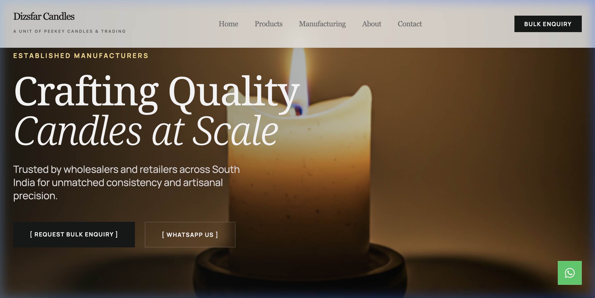
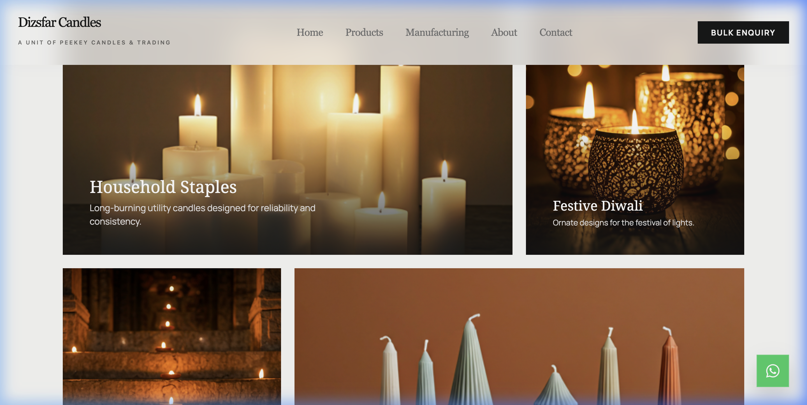

# Pee Key Candle Works And Trading Website

A premium business website for a candle manufacturing company in Wayanad, Kerala, designed to showcase products and attract bulk buyers.

## 🚀 Overview

Modern business website built using **Antigravity AI** and **Google Stitch** for rapid prototyping and design, deployed on Vercel for fast global delivery.

**Purpose:**
- Establish professional online presence
- Showcase manufacturing capabilities
- Generate B2B leads and bulk enquiries
- Display product catalog and company information

## 📸 Screenshots




## 🏭 About the Business

**Pee Key Candle Works And Trading** is a candle manufacturing business based in Wayanad, Kerala, India.

**Product Range:**
- Household candles
- Tealight candles
- Bulk supply for distributors and businesses
- Upcoming premium candle collections

## ✨ Key Features

- 🎨 Premium black & gold aesthetic
- 📱 Mobile-first responsive design
- 🛒 Product catalog (Available + Upcoming ranges)
- 📋 Bulk enquiry form with Google Forms integration
- 💬 WhatsApp quick contact integration
- ⚡ Fast loading with optimized performance

## 🛠️ Tech Stack & Tools

**Design & Development:**
- **Antigravity AI** - AI-powered web design generation
- **Google Stitch** - Component assembly and layout design
- **React** - Frontend framework
- **Vite** - Build tool and dev server
- **Tailwind CSS** - Utility-first styling

**Deployment & Hosting:**
- **Vercel** - Production deployment and hosting
- **Google Forms** - Enquiry data collection
- **Google Sheets** - Lead management backend

## 🏗️ Development Workflow

1. **Design Phase:** Created initial layouts using Antigravity AI
2. **Component Assembly:** Used Google Stitch for UI composition
3. **Customization:** Refined with React + Tailwind CSS
4. **Deployment:** Continuous deployment via Vercel

## 🌐 Architecture

**Frontend-Only Architecture:**
```
User Browser
↓
Vercel (Static Hosting)
↓
React App (Vite Build)
↓
Google Forms (Enquiries) → Google Sheets (Data Storage)
```

**No backend server required** - leverages Google ecosystem for data handling.

## 📩 Enquiry System

**Lead Collection Flow:**
1. Customer fills bulk enquiry form on website
2. Data submitted to Google Forms (embedded)
3. Responses automatically logged in Google Sheets
4. Business owner receives email notifications
5. WhatsApp quick contact available for instant queries

## 🚀 Live Demo

🔗 **Website:** [www.peekeycandles.in](https://www.peekeycandles.in/)

## 📂 Project Structure

```
peekey-candles/
├── src/
│   ├── components/     # React components
│   ├── assets/         # Images, icons
│   └── App.jsx         # Main app component
├── public/             # Static files
├── screenshots/        # README screenshots
├── index.html          # Entry HTML
└── package.json        # Dependencies
```

## 🎯 Target Audience

- Bulk buyers and distributors
- Event organizers
- Religious institutions
- Retail businesses
- Corporate clients

## 📍 Location

**Wayanad, Kerala, India**

## 🔮 Future Enhancements

- [ ] Add ERP system integration (Bolt.new planned)
- [ ] Implement product filtering and search
- [ ] Add customer testimonials section
- [ ] Integrate payment gateway for online orders
- [ ] Multilingual support (English + Malayalam)

## 🤝 Built For

This project was developed as a real-world business solution for **Pee Key Candle Works And Trading**, combining AI-assisted design tools with modern web technologies to deliver a professional online presence.

---

> **Note:** This is a production website for an active business. Built using AI design tools (Antigravity, Google Stitch) and deployed on Vercel for reliability and performance.

## 📧 Contact

For business enquiries: [Add business email]  
WhatsApp: [Add business WhatsApp number]

---

**Built with ❤️ using AI-powered design tools and modern web technologies**
